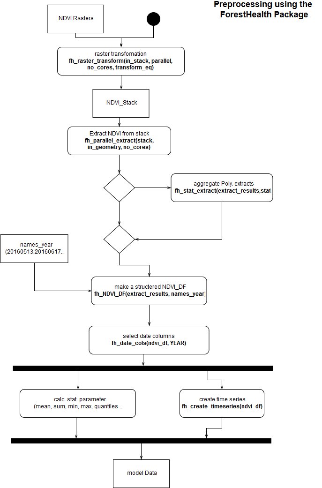

# ForestHealth

This repo holds the ForestHealth package which works togther with the ml_forest-health repository. 
This package consists of useful function to prepare NDVI data for ml and ensures structure and reproducibility for the ml_forest-health repo.

## functions

### raster only

- fh_writerowWise (write raster with low RAM usage)
- fh_parallel_extract (efficient extracting)
- fh_parallel_mask (efficient masking)
- fh_raster_transform (transfrom pixel value for layer and each cell)

### non raster

- fh_date_cols (select date stamp of df)
- fh_NDVI_DF (construct a formatted data table, base und raster::extract or fh_stat_extract)
- fh_stat_extract (apply simpel stat. fun on raster::extract result)
- *fh_time_series (create a time series from a df with date stamps as cols - unfinshed)*

### Example Flow

